# Static Website Hosting on Google Cloud Storage - Project Documentation

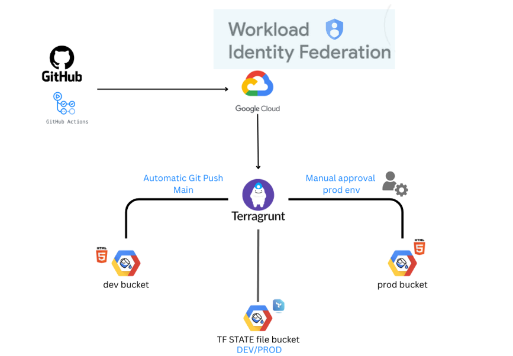

## Initial Setup of Google Cloud

The journey began with creating a **Google Cloud account** and setting up a new project within the **Google Cloud Console**. The project was named `ahmed-jemaa`, which served as the environment for hosting the static website.

After setting up the project, the next step was to **configure IAM roles** to ensure proper access control. I followed the **least privilege** principle by assigning limited roles to users and service accounts to avoid unnecessary permissions.

### **IAM Roles Setup**

For security purposes, I configured the project so that only specific roles could access and manage resources. The roles assigned were as follows:
- **Compute Viewer**: For users who need read-only access to compute resources.
- **Service Account User**: Allowing the user to interact with service accounts.
- **Storage Admin**: To manage the **Google Cloud Storage** resources.
- **Storage Object Viewer**: To grant access to **read-only** access to the objects in the storage bucket.

This **restricted access** ensures that only authorized individuals or services can modify resources, providing an extra layer of security.

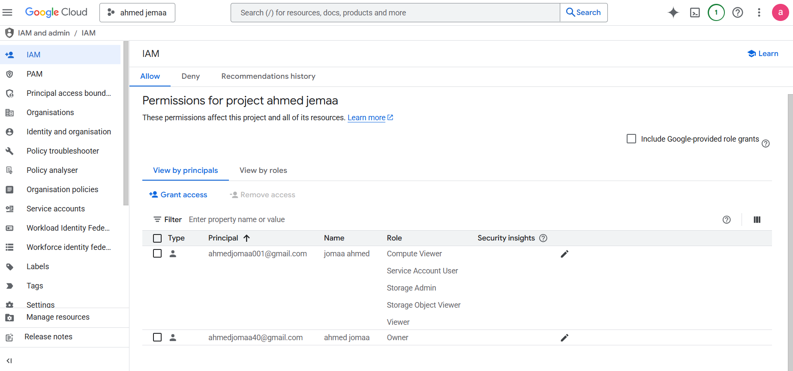

## Bucket Creation for Static Website Hosting

After setting up the project and IAM roles, I moved on to creating the **Google Cloud Storage (GCS)** buckets. I created two buckets for hosting the static website: one for the **dev** environment and one for **prod**.

- **Bucket 1**: `my-static-site-dev` for the development environment.
- **Bucket 2**: `my-static-site-prod` for the production environment.

### **Access Control Configuration**

For **access control**, I chose to enable **Uniform bucket-level access**. This ensured that access to objects in the bucket is managed via **IAM** roles instead of **Access Control Lists (ACLs)**. The **Uniform access control** allows for a cleaner, more manageable setup and better security practices, as everything is controlled at the bucket level.

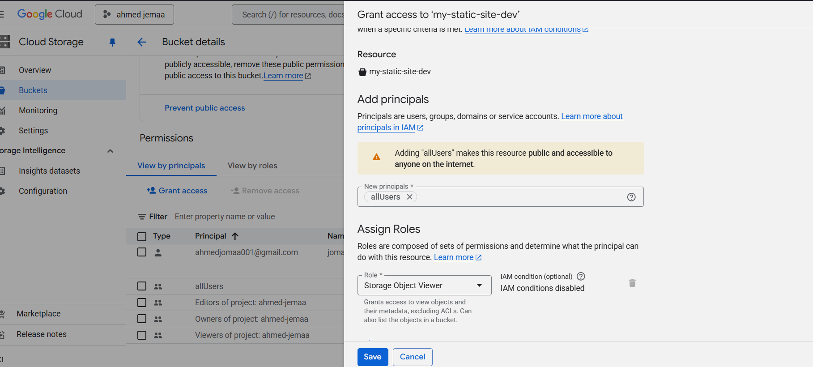

## Website Configuration and Permissions

Once the buckets were created, I uploaded the **static files** for the website, including the `index.html` and `404.html` pages. I configured the **website hosting** options within the GCS bucket settings, specifying `index.html` as the **main page** and `404.html` as the error page.

### **Granting Public Access**

After uploading the files, I needed to make the website publicly accessible. To do this, I navigated to the **Permissions** tab in the GCS bucket settings and added the **allUsers** group. By assigning the **Storage Object Viewer** role to `allUsers`, I made the `index.html` file publicly accessible.

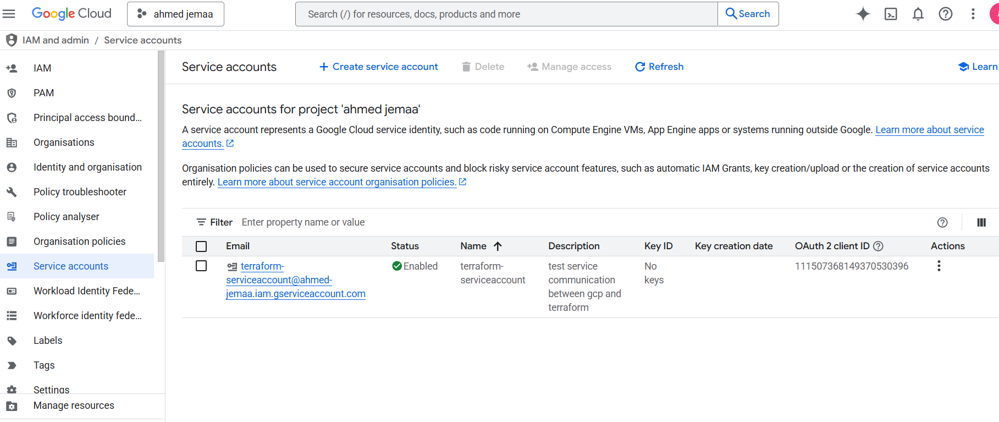

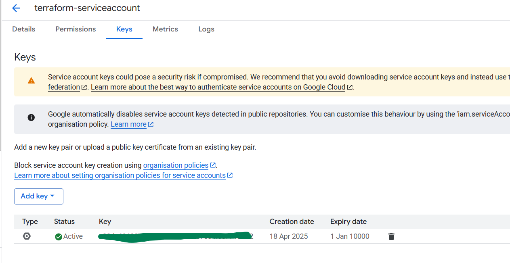

## Automating Infrastructure with Terragrunt

To enhance efficiency, automation, and scalability, I decided to use **Terragrunt** for infrastructure management, specifically to automate the creation and management of the environment-specific configurations (e.g., **dev** and **prod**).

### **Terragrunt Setup**

Terragrunt simplifies Terraform's configuration management by organizing configurations for multiple environments. I used Terragrunt to handle **multiple environments** in separate directories (`dev` and `prod`), while still reusing the Terraform module for the static site configuration.

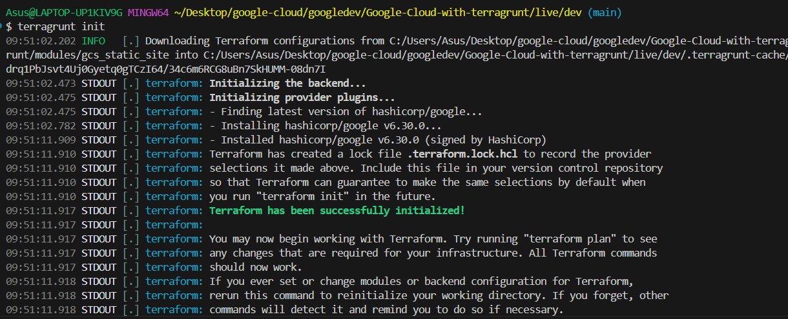

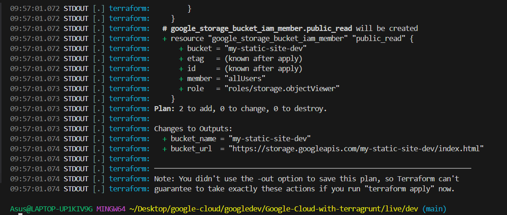

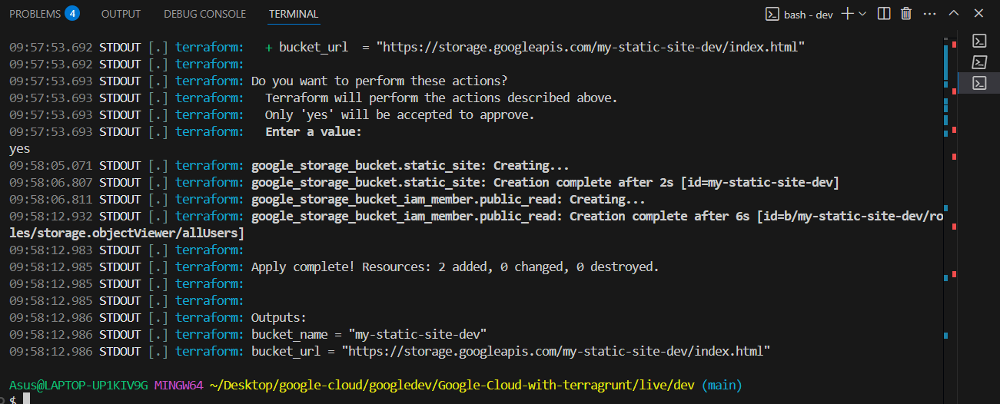

### **Results**

With this, your static website is now hosted on Google Cloud Storage, and the process is fully automated using Terragrunt. Both the dev and prod environments have been deployed and are publicly accessible.

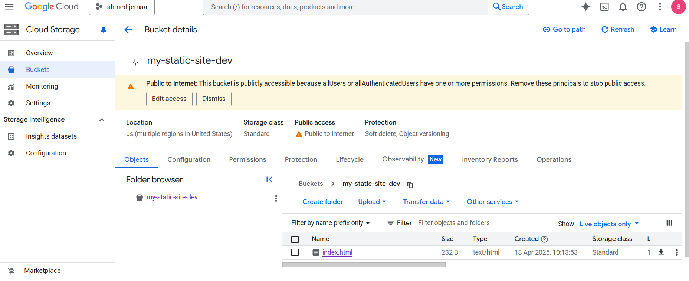

### **Continuous Integration & Deployment with GitHub Actions**

To ensure safe and repeatable delivery of infrastructure changes, a **GitHub Actions** workflow has been configured to deploy updates automatically. The workflow relies on **Workload Identity Federation (OIDC)**,eliminating the need for long‑lived service‑account keys while still granting the pipeline the permissions it requires.

Key characteristics:

* **Trigger** – Executes on every push to the `main` branch.
* **Authentication** – GitHub exchanges an ephemeral OIDC token for a short‑lived Google Cloud service‑account identity.
* **Execution** – Terraform/Terragrunt initialise, plan, and apply the configuration for the target environment.
* **Outcome** – Website assets are synchronised to the correct GCS bucket, and the site is updated within seconds of a commit.

The images below illustrate the critical elements of this setup:

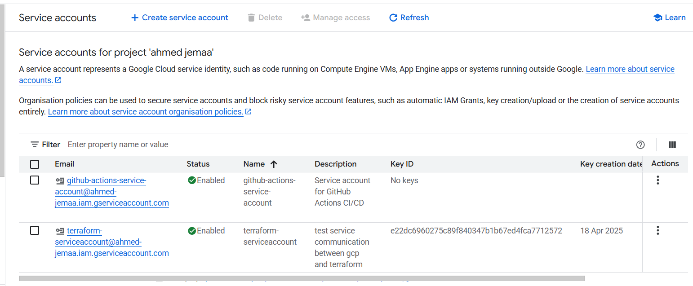
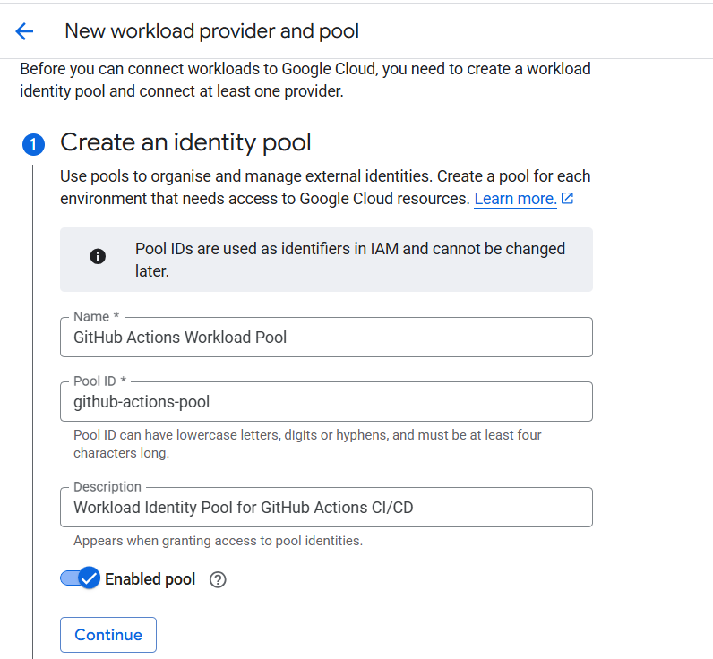
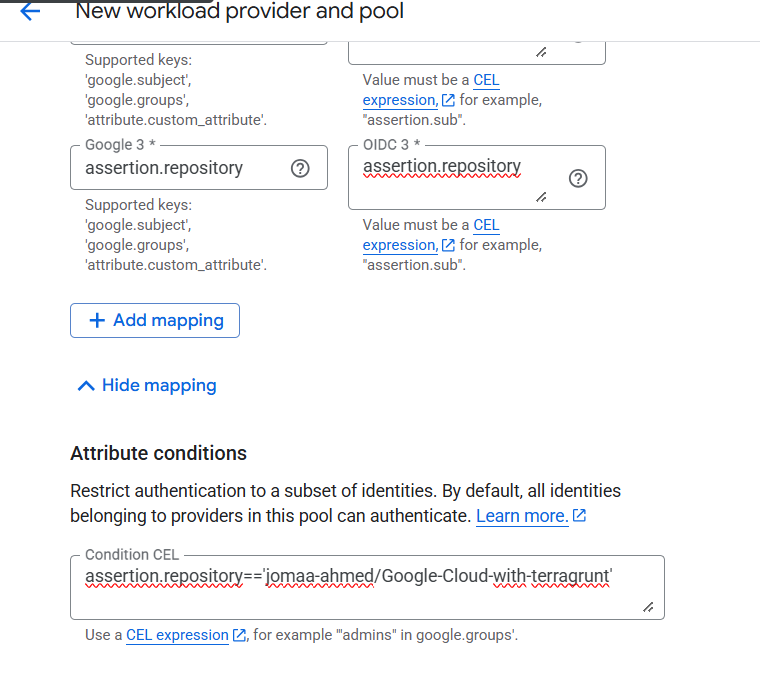
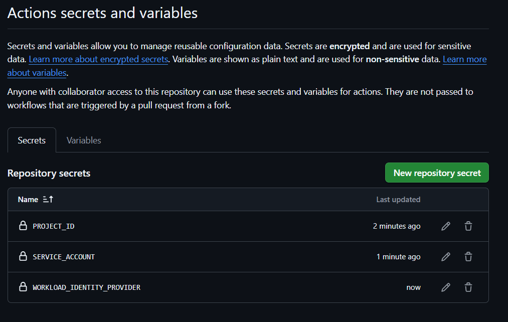
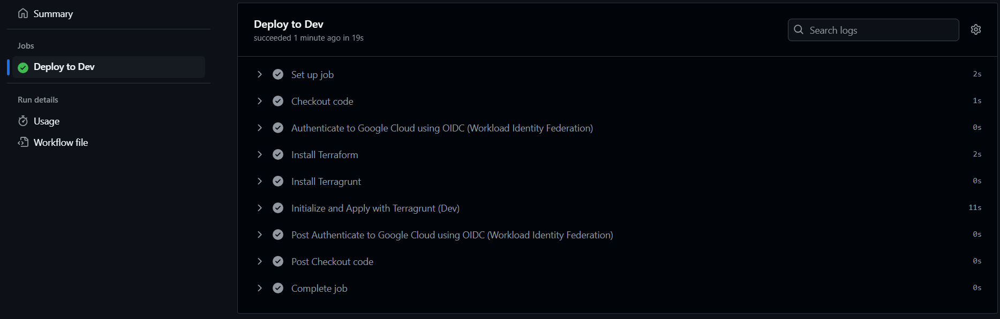

### **Manual Approval for Production Deployments**

To minimise risk, deployments to **production** require explicit human approval.  
This gate is implemented with GitHub Environments and the *required reviewers* rule.

**Configure the protection rule** – In the repository i  enable *Required reviewers* and add at least one maintainer.

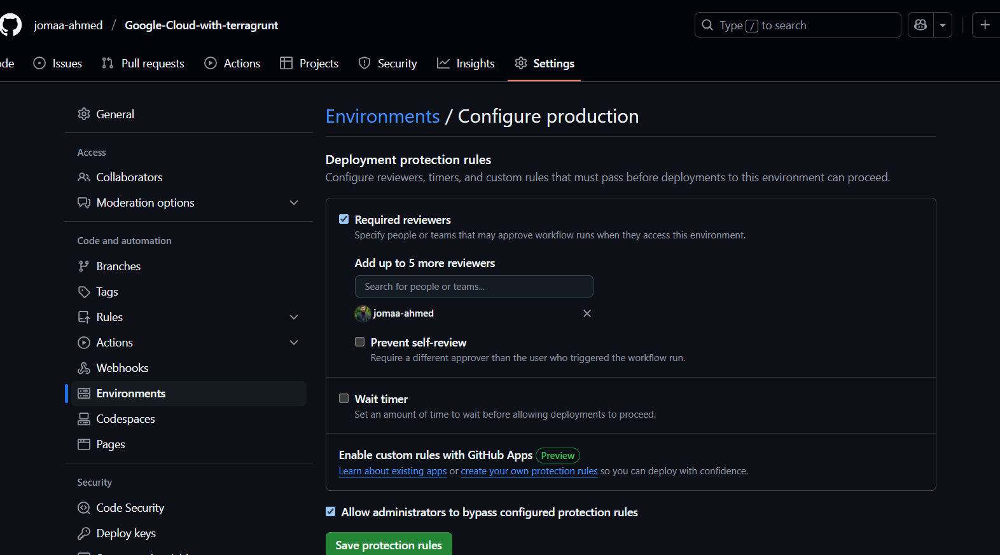

**Pipeline waits for approval** – When the workflow reaches the `Deploy to Prod` job, GitHub places the run in a *pending* state until approval is granted.

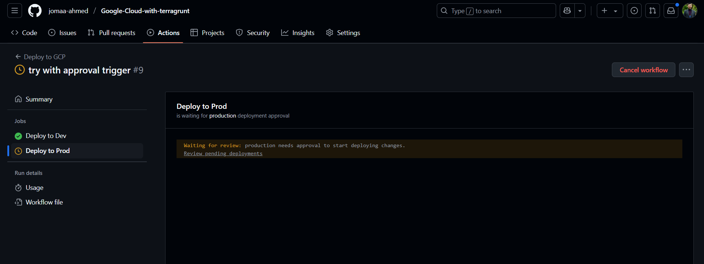

**Reviewer approves the deployment** – An authorised reviewer opens the *Review pending deployments* dialog and clicks **Approve and deploy**.

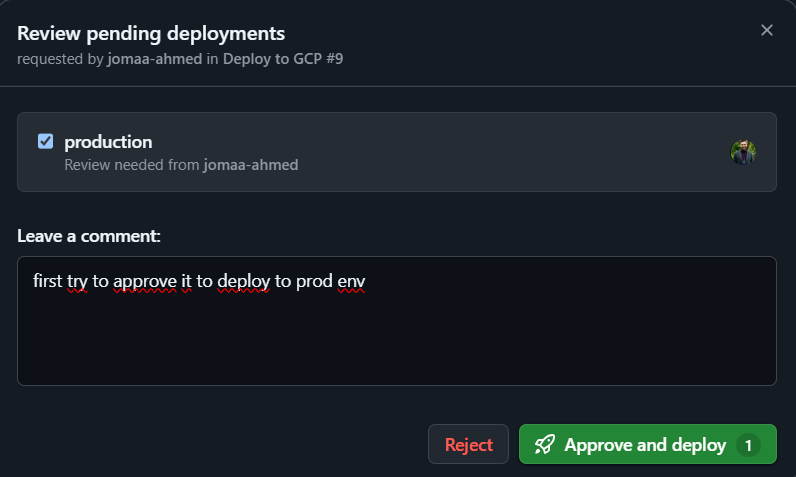

**Deployment resumes and completes** – After approval, the job proceeds, authenticates via OIDC, executes Terragrunt, and finishes successfully.

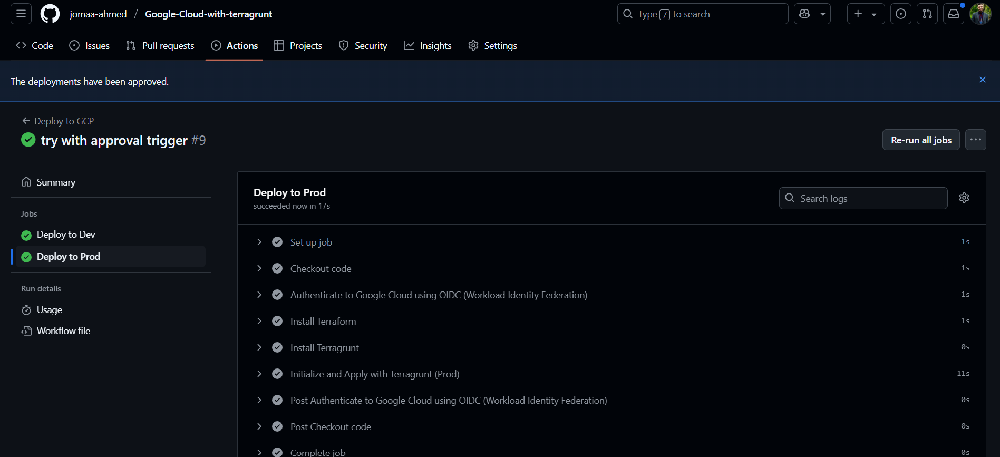

**Remote Backend & Terraform State Management**

A dedicated bucket stores Terraform state files so that state locking and versioning are handled centrally.

**Initial bucket list** – only website buckets present.  
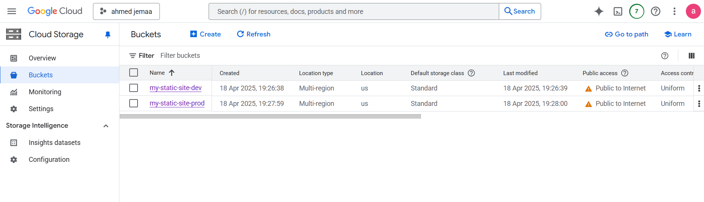

**Create the state bucket** – `tf-state-ahmed-jemaa`.  
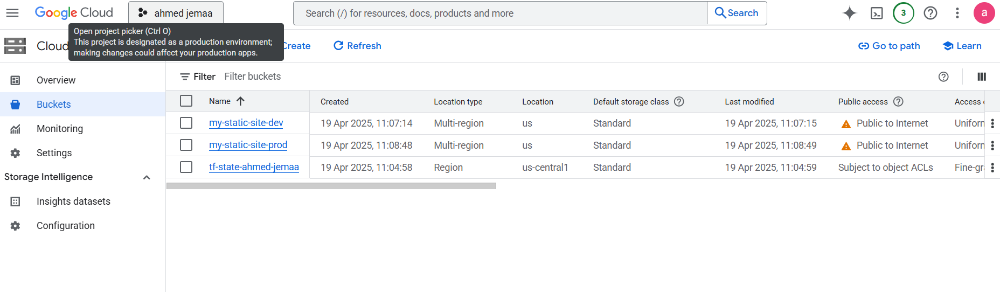

**Folder structure** – separate prefixes (`dev/`, `prod/`).  
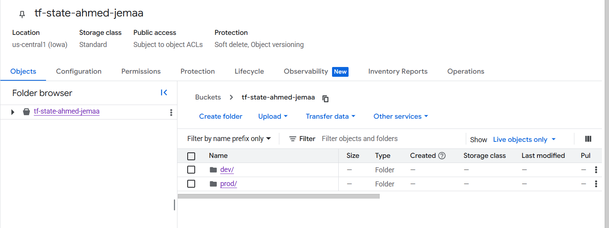

## 🏁 Conclusion

- **Static Site** – Publicly served from two GCS buckets (`dev(main)`, `prod`).
- **IaC** – Terraform modules orchestrated by Terragrunt for a DRY, multi‑environment layout.
- **Remote Backend** – Terraform state stored in a versioned, locked `tf‑state‑ahmed‑jemaa` bucket.
- **CI/CD** – GitHub Actions pipelines authenticate to GCP via OIDC (no long‑lived keys) and deploy on every push.
- **Prod Gate** – Manual approval required before production runs, enforced with GitHub Environments.
- **Security** – Least‑privilege IAM, uniform bucket‑level access, state‑file soft delete & versioning.
